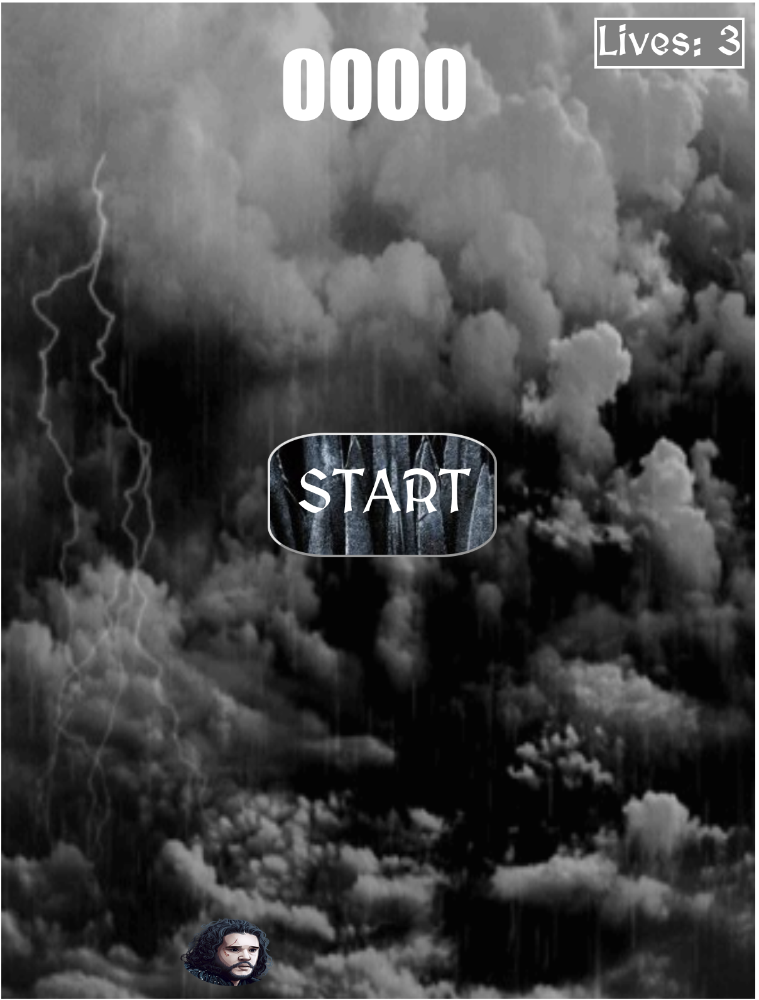
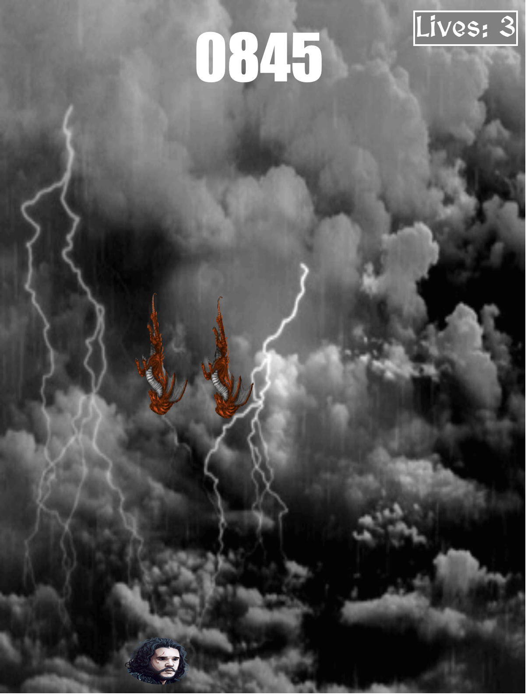
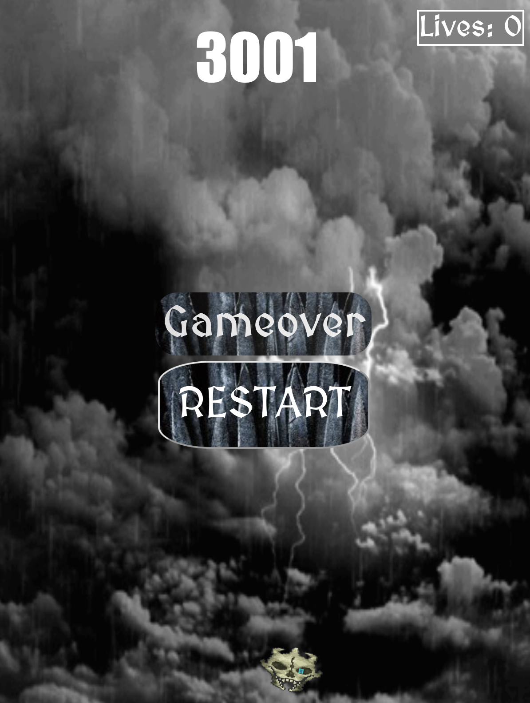

# Game of thrones inspired "I CAN HAZ CHEEZBURGER?!??"

# Introduction

The game is inspired on the HBO series Game Of Thrones, there are no spoilers on this game.

There is music added, so remember to wear headphones.

---

## **The Game**

You are Jon Snow and the goal is to not be eaten (touched) by the dragons that fall from the top of the screen, if you're touched 3 times game is over.

## **Minor changes**

1. Game ends if the player doesnt have lifes left, the remaining dragons are cleared from the board, the player "dies" and turns into a skull that keeps spinning, a banner of game over appears and floats and a restart button appears

2. Changed size of the game board to fit more dragons (enemies).

3. There is a start button, the score in the beginning is 0 and the lives are 3 (more ahead).

4. Start/Restart button

## **Major changes**

1. Score update, every 5 seconds the multiplayer increases to 3 times the original value.

2. The difficulty increases every 5 seconds, an extra dragon is allowed on the gameboard to a maximum of 8 at a time (full-board)

3. Lives system, 3 lives and every time the player is touched it decreases by 1.

4. Music when the start games with the show theme and when it ends with the rains of castamere.

"Disclaimer: This project is a non-commercial, educational exercise based on the Game of Thrones series. It utilizes Game of Thrones characters and music solely for illustrative and educational purposes. This project is not affiliated with, endorsed by, or sponsored by the creators or rights holders of Game of Thrones. No copyright infringement is intended."